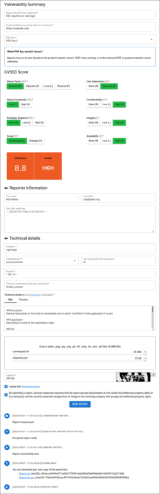

# VDP Form

A web application to securely disclose vulnerabilities.

[](https://hub.docker.com/r/yeswehack/vdp-form)
[](https://www.npmjs.com/package/quasar-ui-vdp-form/)
[](https://www.npmjs.com/package/quasar-app-extension-vdp-form/)
[](https://github.com/yeswehack/vdp-form)

Compatible with [Quasar](https://quasar.dev/) UI v2 and [Vue](https://vuejs.org/) 3.

[](ui/docs/screenshot.png)

# Structure
* [/app](app) - Ready-to-use VDP Form application
* [/ui](ui) - standalone npm package
* [/app-extension](app-extension) - Quasar app extension

# How it works
- Someone finds a vulnerability or a security bug on your website or product
- They go to your VDP Form application
- They describe the vulnerability
- Their report is encrypted in their browser
- You receive the report via e-mail
- The Internet is safer!

# Usage

## Docker image

### Build
```shell
docker build -t my-vdp -f docker/Dockerfile .
```

### Run
```shell
docker run \
    -v $(pwd)/config/backend/nodemailer.json:/config/nodemailer.json \
    -v $(pwd)/config/frontend/pgpkeys:/config/pgpkeys \
    -e BACKEND_MAIL_CONFIG_FILE=/config/nodemailer.json \
    -e FRONTEND_FORM_PGP_KEYS_PATH=/config/pgpkeys \
    -p3000:3000 my-vdp
```
Then go to http://localhost:3000.

## Environment variables:

### Backend
- `PORT`: HTTP port of the application (default: `3000`)
- `BACKEND_MAIL_CONFIG_FILE`: (**required**) path to the [SMTP configuration file](#smtp-configuration-file)
- `BACKEND_HTTP_ACCESS_CONTROL_ALLOW_ORIGIN`: value of the HTTP header `Access-Control-Allow-Origin` for all api response (default: `*`)
- `BACKEND_CAPTCHA_ENABLE`: boolean (`true`/`false`) flag to enable the form captcha (default: `true`)
- `BACKEND_CAPTCHA_CRYPT_PASSWORD`: password for captcha keys encryption (default: random UUID4, changes at every start)
- `BACKEND_CAPTCHA_EXPIRATION_MS`: expiration delay of the captchas, in milliseconds (default: `3600000`)
- `BACKEND_MAIL_REPORT_TEMPLATE_TEXT_FILE`: path to the file containing the template for the HTML version of the e-mails sent when a vulnerability is disclosed ([see default](app/src/templates/mail-new-disclosure-html.txt))
- `BACKEND_MAIL_REPORT_TEMPLATE_HTML_FILE`: path to the file containing the template for the plain-text version of the e-mails sent when a vulnerability is disclosed ([see default](app/src/templates/mail-new-disclosure-text.txt))
- `BACKEND_MAIL_REPORT_SUBJECT_TEMPLATE`: subject of the e-mails sent when a vulnerability is disclosed (default: `New Vulnerability Disclosure`)
- `BACKEND_MAIL_REPORT_FROM`: value of the "from" field of the e-mails sent when a vulnerability is disclosed (default: `vdp-form@[hostname]`)
- `BACKEND_MAIL_REPORT_TO`: recipient of the e-mails sent when a vulnerability is disclosed (default: `security@[hostname]`)


#### SMTP configuration file

[Nodemailer](https://nodemailer.com) is used to send the encrypted vulnerability disclosures via e-mail.

You must provide the path to a JSON file that contains the Nodemailer configuration via the `BACKEND_MAIL_CONFIG_FILE` environment variable.

An example configuration file would be:

```json
{
  "host": "smtp.example.com",
  "port": 587,
  "secure": false,
  "auth": {
    "user": "username",
    "pass": "password"
  }
}
```

See [Nodemail SMTP transport](https://nodemailer.com/smtp/) for more configuration options.

### Frontend
- `FRONTEND_FORM_PGP_KEYS_PATH`: (**required**) path to the directory containing the [PGP public keys](#pgp-keys) used for encrypting the vulnerability disclosures
- `FRONTEND_VUE_URL_JS`: url of [Vue.js](https://vuejs.org) global JavaScript build file (default: `https://cdn.jsdelivr.net/npm/vue@3.2.39/dist/vue.global.prod.js`)
- `FRONTEND_QUASAR_URL_JS`: url of [Quasar](https://quasar.dev) global JavaScript build file (default: `https://cdn.jsdelivr.net/npm/quasar@2.8.4/dist/quasar.umd.prod.js`)
- `FRONTEND_QUASAR_URL_CSS`: url of [Quasar](https://quasar.dev) global CSS build file (default: `https://cdn.jsdelivr.net/npm/quasar@2.8.4/dist/quasar.prod.css`)
- `FRONTEND_MAIN_TITLE`: HTML title of the index/form page (default: `VDP`)
- `FRONTEND_FORM_ATTACHMENT_MAX_SIZE_BYTES`: maximum size of individual uploadable attachments in the form, in bytes (default: `2097152`)
- `FRONTEND_FORM_ATTACHMENT_ALLOWED_EXTENSIONS`: allowed attachment files extensions list, separated by spaces (default: `txt jpeg jpg png gif tiff bmp`)
- `FRONTEND_FORM_LOGS_AUTO_SCROLL`: boolean (`true`/`false`) flag to enable autoscrolling of the logs when submitting a vulnerability (default: `true`)
- `FRONTEND_FORM_TIMESTAMP_FORMAT`: format of the timestamp of the submission logs, see [dateformat](https://github.com/felixge/node-dateformat#mask-options) (default: `yyyy/mm/dd HH:MM:ss.l`)
- `FRONTEND_FORM_NOTIFICATIONS_POSITION`: default position of the notifications (default: `top` ; allowed values: `top-left`, `top-right`, `bottom-left`, `bottom-right`, `top`, `bottom`, `left`, `right`, `center`)
- `FRONTEND_FORM_SUCCESS_NOTIFICATION_POSITION`: position of the notification shown when a report has been successfully submitted
- `FRONTEND_FORM_ERRORS_NOTIFICATION_POSITION`: position of the notifications shown when an error occurs
- `FRONTEND_FORM_DISCLOSURE_POLICY_NOTIFICATION_POSITION`: position of the notification shown when the user click on the "Disclosure policy" link
- `FRONTEND_PARTIAL_HEAD`: path to an HTML file that will be rendered in the `<head/>` element of the form page
- `FRONTEND_PARTIAL_BODY_BEFORE_FORM`: path to an HTML file that will be rendered in the `<body/>` element of the form page, just before the form
- `FRONTEND_PARTIAL_BODY_AFTER_FORM`: path to an HTML file that will be rendered in the `<body/>` element of the form page, just after the form
- `FRONTEND_PARTIAL_BODY_AFTER_SCRIPT`: path to an HTML file that will be rendered in the `<body/>` element of the form page, after the form initialization script


#### PGP keys

In order to encrypt vulnerability reports, you must provide the path to a directory that contains at least one file containing a PGP public key via the `BACKEND_MAIL_CONFIG_FILE` environment variable.

If there are multiple files in the directory, their full name, with extension, will be used to show in a drop-down list in the form.
For example, for a directory with the following structure:
```
/pgpkeys
 |- Key1
 |- Key2
```
The drop-down list will display 2 items `Key1` and `Key2`.

If there is only one file in the directory, the drop-down list will no be displayed.

All files in the directory must contain one PGP public key similar to:
```
-----BEGIN PGP PUBLIC KEY BLOCK-----

mQGNBGKxuBsBDAC0qZMBlhYaa2ruhp88GwkMuCOrW1rQY6DfkORvKjetwvwxMwBJ
[... more data ...]
ACLhTZ0Y9GKAN1+V0KB6dqgE3MHZAw1NZRDTnlfN3M345fj/Ypg09gw5KzAAtFVa
rCHIDOh1bOdGsOYVS9BaSuhPtwf/zYAC9VA+mI2qzQJji7thrBsx
=wicI
-----END PGP PUBLIC KEY BLOCK-----
```

# License
MIT (c) YesWeHack project@yeswehack.com
